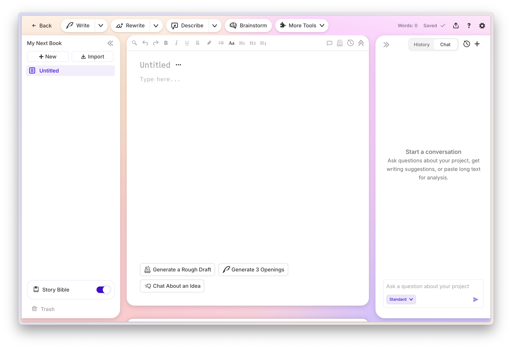
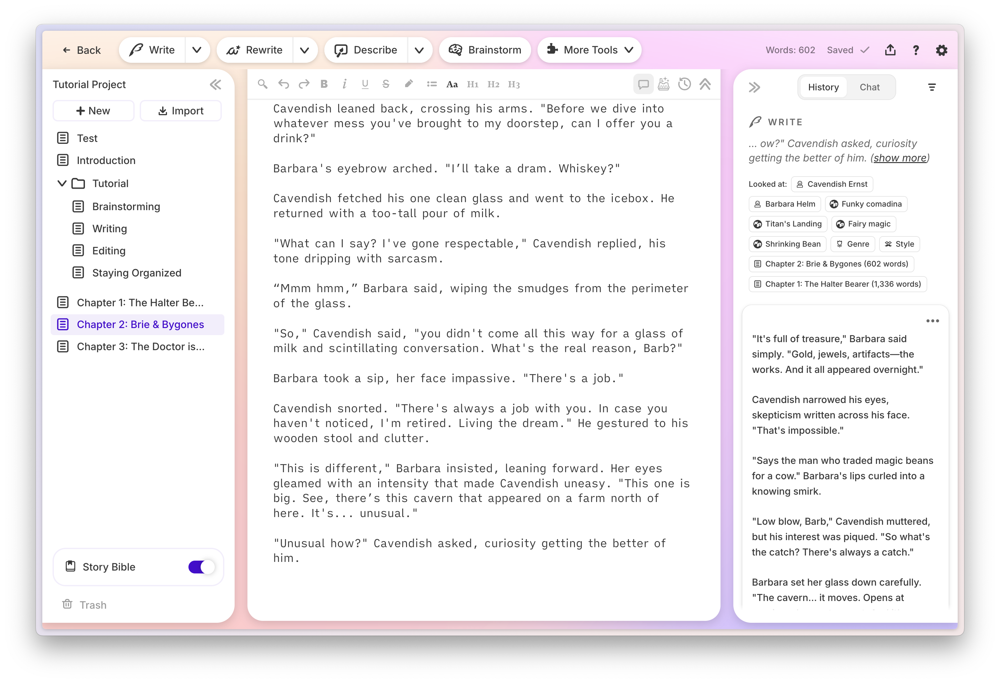
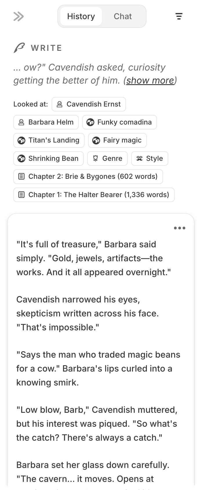

# Interface

Article Description: Wow, that’s a lot of buttons. Here’s how to get around Sudowrite
Last Updated: January 7, 2026
Published: Yes
Suggested: No

[https://youtu.be/OY0UmusC8Dk](https://youtu.be/OY0UmusC8Dk)

# **Sudowrite Main Interface**

Sudowrite’s main writing interface inside of a project is divided into 3 columns.

In the left column you have the Project’s Document organization. The primary writing area, your text editor, comprises the middle section. Finally, to the right is the Chat bar, where you’ll also find a History section that stores results from AI tools as “cards.”

A screenshot of Sudowrite’s editor, the main writing interface.

## Projects, Docs and Folders

On login, you’re dropped into Sudowrite’s homepage. That’s where you’ll find all of your **Projects**. Click into any project to enter the editor (as depicted above), where you’ll find your **Document**(s) listed along the left. You can **Add New** documents or **Import** your existing work here in the left nav—in either case, those individual docs will be listed there. Add New also gives you the option of creating **Folders**, which can be used to organize your Documents.

Meanwhile, each of Sudowrite’s AI functions (highlighted below) outputs results as Cards, which appear in the History bar on the right side of the text editor.

## Cards

Most Sudowrite features will place your responses into a **Card** in the History section on the right side of the screen. (First Draft, and Quick Edit do not.)

Sudowrite’s main interface places the AI responses from Sudowrite’s AI features into cards on the right side of the screen. You can click on the cards to expand the stacks, or click again to collapse them.

Click anywhere on the white card to collapse the response, and click again to expand it and view the full context of the prompt and response. The top of every card pile will have the *Prompt* in italics: this is what Sudowrite took into consideration in order to generate the cards. You’ll also get “chiclets” which showcase the context the AI took into consideration while doing its work. The card will be labeled with the name of the feature you used. In the example below, it was Write.

The prompting text that Sudowrite considered is always in italics above the Cards, while “Looked at:” showcases additional context from Story Bible or prior documents.

The last part of the interface to be aware of is the Toolbar that sits along the top of those three columns. The Toolbar is where you’ll find several of Sudowrite’s core AI features, which you can read more about next.